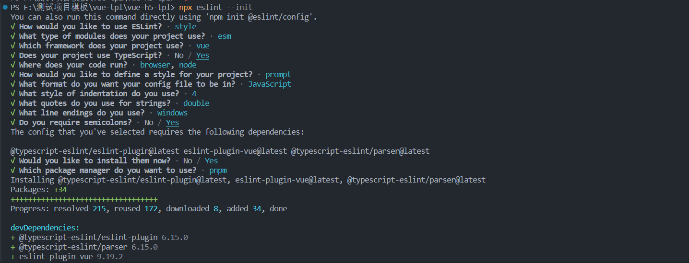
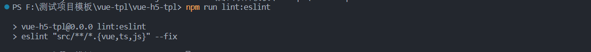
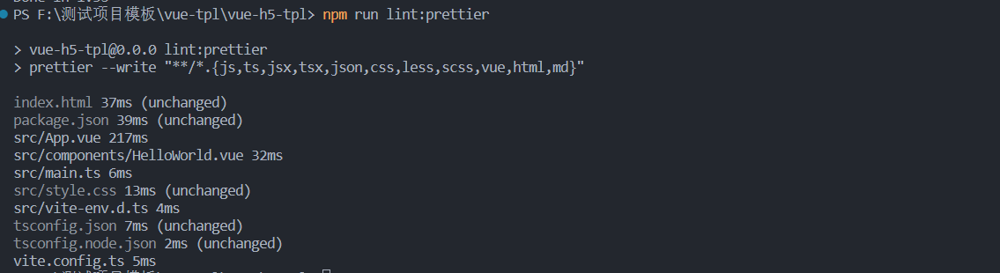
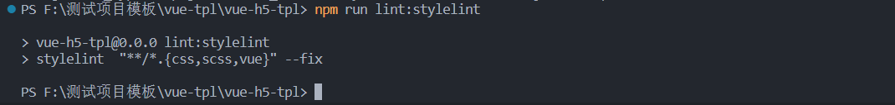

## 1. 项目搭建

```js
pnpm create vite vue-h5-tpl --template vue-ts

cd vue-h5-tpl
pnpm i
pnpm run dev
```

出现下图，项目启动成功


> **_Vscode_** (vscode 版本 1.85), 需要安装 ESLint Prettier Stylelint EditorConfig 插件， setting.json 添加一下配置

```js
 "editor.defaultFormatter": "esbenp.prettier-vscode",
  "editor.formatOnSave": true,
  "editor.codeActionsOnSave": {
    "source.fixAll": "explicit",
    "source.fixAll.eslint": "explicit",
    "source.fixAll.stylelint": "explicit"
  },
  "stylelint.validate": ["less", "html", "scss", "css", "vue"],
```

## 2. 集成 ESLint

- 2-1. 安装 Eslint 初始化 eslint 配置文件

```js
pnpm add eslint eslint-config-prettier eslint-plugin-prettier -D
npx eslint --init  // 或者 npm init @eslint/config
```


eslint 自动生成的 .eslintrc.cjs 配置内容如下：
在默认配置基础上需要添加 解决 Prettier 的配置代码(11 行)；修改解析器为 parser: vue-eslint-parser(23 行)

```js
module.exports = {
  env: {
    browser: true,
    es2021: true,
    node: true,
  },
  extends: [
    "eslint:recommended",
    "plugin:@typescript-eslint/recommended",
    "plugin:vue/vue3-essential",
    "plugin:prettier/recommended",
  ],
  overrides: [
    {
      env: {
        node: true,
      },
      files: [".eslintrc.{js,cjs}"],
      parserOptions: {
        sourceType: "script",
      },
    },
  ],
  parser: "vue-eslint-parser",
  parserOptions: {
    ecmaVersion: "latest",
    parser: "@typescript-eslint/parser",
    sourceType: "module",
  },
  plugins: ["@typescript-eslint", "vue"],
  rules: {
    "vue/comment-directive": "off",
    "vue/multi-word-component-names": "off",
    "no-undef": "off",
    "@typescript-eslint/no-explicit-any": "off",
  },
};
```

- 2-2. ESLint 忽略文件配置，根目录新建 .eslintignore 文件，添加忽略文件， ESLint 校验会忽略这些文件，配置如下：

```js
dist
node_modules
.vscode
.idea
public
.eslintcache
edit

*.d.ts
.husky
.vscode
.idea
*.sh
src/assets
src/**/font

# .eslintrc.cjs
# .prettierrc.cjs
# .stylelintrc.cjs
# commitlint.config.cjs
.eslintrc-auto-import.json
```

- 2-3. ESLint 检测指令, package.json 添加 eslint 检测指令：

```js
  "scripts": {
    "lint:eslint": "eslint \"src/**/*.{vue,ts,js}\" --fix"
  }
```

- 2-4. ESLint 检测 & 验证

```js
npm run lint:eslint
```

出现以下即为成功格式化


## 3. 集成 Prettier

- 3-1. 安装 prettier, 根目录创建 .prettierrc.cjs 文件, 具体配置如下：

```js
  pnpm add prettier -D
```

```js
module.exports = {
  // 每行最多字符数量，超出换行(默认80)
  printWidth: 100,
  // 结尾添加分号
  semi: true,
  // true 使用单引号 false 使用双引号
  singleQuote: false,
  // 缩进空格数，默认2个空格
  tabWidth: 2,
  // 文件换行符
  endOfLine: "crlf",
  // 元素末尾是否加逗号，默认es5: ES5中的 objects, arrays 等会添加逗号，TypeScript 中的 type 后不加逗号
  trailingComma: "es5",
  // true 空格使用 tabs  false 使用 space
  useTabs: false,
  // 对象字面量的括号之间打印空格 (true - Example: { foo: bar } ; false - Example: {foo:bar})
  bracketSpacing: true,
};
```

- 3-2. Prettier 忽略文件配置，根目录新建 .prettierignore 文件，添加忽略文件， Prettier 校验会忽略这些文件，配置如下：

```js
dist
node_modules
public
.husky
.vscode
.idea
*.sh
*.md

src/assets
```

- 3-3. Prettier 检测指令, package.json 添加 prettier 检测指令：

```js
  "scripts": {
    "lint:prettier": "prettier --write \"**/*.{js,ts,jsx,tsx,json,css,less,scss,vue,html,md}\""
  }
```

- 3-4. Prettier 检测 & 验证

```js
npm run lint:prettier
```

出现以下即为成功格式化


## 4. 集成 Stylelint

- 4-1. 安装 Stylelint 相关依赖
  各个依赖说明

1. stylelint [stylelint 核心库](https://stylelint.io/)
2. stylelint-config-standard [stylelint-config-standard](https://github.com/stylelint-scss/stylelint-config-recommended-scss)
3. stylelint [扩展 stylelint-config-recommended 共享配置并为 SCSS 配置其规则](https://github.com/stylelint-scss/stylelint-config-recommended-scss)
4. stylelint-config-recommended-vue [扩展 stylelint-config-recommended 共享配置并为 Vue 配置其规则](https://github.com/ota-meshi/stylelint-config-recommended-vue)
5. stylelint-config-recess-order [提供优化样式顺序的配置](https://jingyan.baidu.com/article/647f0115cf48957f2148a8a3.html)
6. stylelint-config-html [共享 HTML (类似 HTML) 配置，捆绑 postcss-html 并对其进行配置](https://github.com/ota-meshi/stylelint-config-html)
7. postcss-html [解析 HTML (类似 HTML) 的 PostCSS 语法](https://github.com/gucong3000/postcss-html)
8. postcss-scss [PostCSS 的 SCSS 解析器](https://github.com/postcss/postcss-scss)

```js
pnpm add -D stylelint stylelint-config-standard stylelint-config-recommended-scss stylelint-config-recommended-vue postcss postcss-html postcss-scss stylelint-config-recess-order stylelint-config-html

```

- 4-2. 根目录创建 .stylelintrc.cjs 文件, 具体配置如下：

```js
module.exports = {
  // 继承推荐规范配置
  extends: [
    "stylelint-config-standard",
    "stylelint-config-recommended-scss",
    "stylelint-config-recommended-vue/scss",
    "stylelint-config-html/vue",
    "stylelint-config-recess-order",
  ],
  // 指定不同文件对应的解析器
  overrides: [
    {
      files: ["**/*.{vue,html}"],
      customSyntax: "postcss-html",
    },
    {
      files: ["**/*.{css,scss}"],
      customSyntax: "postcss-scss",
    },
  ],
  // 自定义规则
  rules: {
    "at-rule-empty-line-before": "never",
    "import-notation": "string", // 指定导入CSS文件的方式("string"|"url")
    "selector-class-pattern": null, // 选择器类名命名规则
    "custom-property-pattern": null, // 自定义属性命名规则
    "keyframes-name-pattern": null, // 动画帧节点样式命名规则
    "no-descending-specificity": null, // 允许无降序特异性
    // 允许 global 、export 、deep伪类
    "selector-pseudo-class-no-unknown": [
      true,
      {
        ignorePseudoClasses: ["global", "export", "deep"],
      },
    ],
    // 允许未知属性
    "property-no-unknown": [
      true,
      {
        ignoreProperties: ["menuBg", "menuText", "menuActiveText"],
      },
    ],
  },
};
```

- 4-3. Stylelint 忽略文件配置，根目录新建 .stylelintignore 文件，添加忽略文件， Stylelint 校验会忽略这些文件，配置如下：

```js
dist
node_modules
public
.husky
.vscode
.idea
*.sh
*.md

src/assets
*.d.ts
.eslintrc-auto-import.json

```

- 4-4. Stylelint 检测指令, package.json 添加 stylelint 检测指令：

```js
    "lint:stylelint": "stylelint  \"**/*.{css,scss,vue}\" --fix"
```

出现以下即为成功格式化


## 4. 集成 EditorConfig

- 4-1. [EditorConfig](http://editorconfig.org) 根目录创建 .editorconfig 文件，具体配置如下：

```js
root = true

# 表示所有文件适用
[*]
charset = utf-8 # 设置文件字符集为 utf-8
end_of_line = crlf # 控制换行类型(lf | cr | crlf)
indent_style = space # 缩进风格（tab | space）
insert_final_newline = true # 始终在文件末尾插入一个新行

# 表示仅 md 文件适用以下规则
[*.md]
max_line_length = off # 关闭最大行长度限制
trim_trailing_whitespace = false # 关闭末尾空格修剪
```
