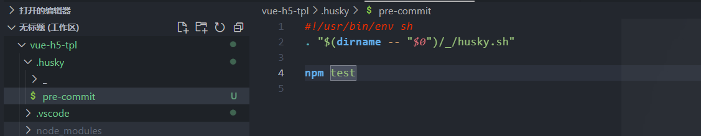
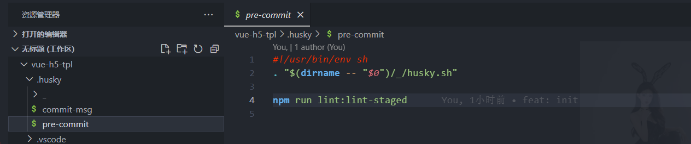
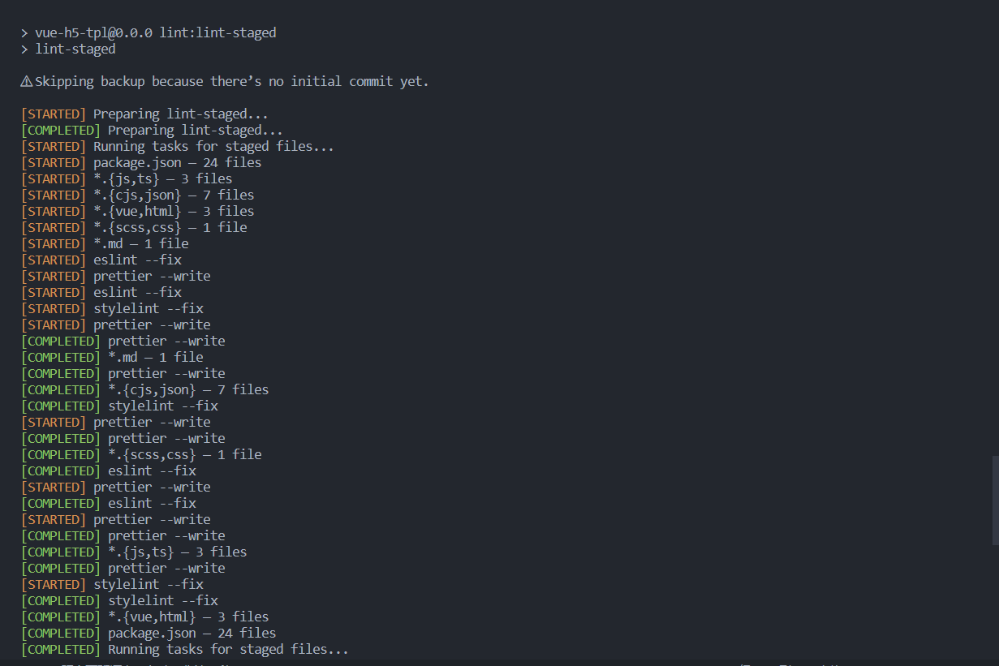

> 需要先 git init 初始化一个本地仓库

## 1. 安装 Husky

- Husky 是 Git 钩子工具，可以设置在 git 各个阶段（pre-commit、commit-msg 等）触发。
- [官方网站](typicode.github.io/husky)
- 1-1. 自动安装 husky

```js
npx husky-init && npm install
```

出现 .husky 文件夹即可


## 2. 安装 Lint-staged

- lint-staged 是一个在 git add 到暂存区的文件运行 linter (ESLint/Prettier/StyleLint) 的工具，避免在 git commit 提交时在整个项目执行
- 2-1. 安装

```js
pnpm add -D lint-staged
```

- 2-2. package.json 中添加不同文件在 git 提交执行的 lint 检测配置

```js
"lint-staged": {
    "*.{js,ts}": [
      "eslint --fix",
      "prettier --write"
    ],
    "*.{cjs,json}": [
      "prettier --write"
    ],
    "*.{vue,html}": [
      "eslint --fix",
      "prettier --write",
      "stylelint --fix"
    ],
    "*.{scss,css}": [
      "stylelint --fix",
      "prettier --write"
    ],
    "*.md": [
      "prettier --write"
    ]
  }

```

- 2-3. package.json 的 scripts 添加 lint-staged 指令

```js
  "scripts": {
    "lint:lint-staged": "lint-staged"
  }

```

- 2-4. 根目录 .husky 目录下 pre-commit 文件中的 npm test 修改为 npm run lint:lint-staged
  

```js
npm run lint:lint-staged
```

git 提交代码触发检测


## 3. 安装 Commitlint

- Commitlint 检查您的提交消息是否符合 Conventional commit format
- 3-1. 安装

```js
pnpm add @commitlint/cli @commitlint/config-conventional -D
```

- 3-2. 根目录创建 commitlint.config.cjs 配置文件，具体配置

```js
module.exports = {
  // 继承的规则
  extends: ["@commitlint/config-conventional"],
  // @see: https://commitlint.js.org/#/reference-rules
  rules: {
    "subject-case": [0], // subject大小写不做校验

    // 类型枚举，git提交type必须是以下类型
    "type-enum": [
      2,
      "always",
      [
        "feat", // 新增功能
        "fix", // 修复缺陷
        "docs", // 文档变更
        "style", // 代码格式（不影响功能，例如空格、分号等格式修正）
        "refactor", // 代码重构（不包括 bug 修复、功能新增）
        "perf", // 性能优化
        "test", // 添加疏漏测试或已有测试改动
        "build", // 构建流程、外部依赖变更（如升级 npm 包、修改 webpack 配置等）
        "ci", // 修改 CI 配置、脚本
        "revert", // 回滚 commit
        "chore", // 对构建过程或辅助工具和库的更改（不影响源文件、测试用例）
      ],
    ],
  },
};
```

- 3-4. 执行下面命令生成 commint-msg 钩子用于 git 提交信息校验
  > 正确的提交信息：git commit -m 'feat: 这是一段提交信息'

```js
npx husky add .husky/commit-msg "npx --no -- commitlint --edit $1"
```
