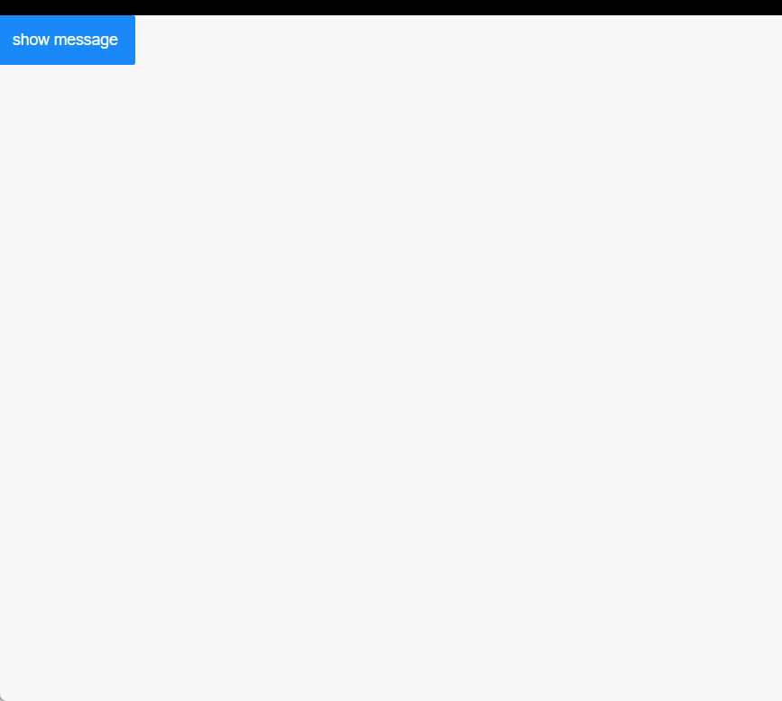

## 目录结构

> Message
>
> > - index.tsx
> > - index.scss

## 效果预览



## index.tsx

```tsx
import { createApp, defineComponent, Transition, ref, watch } from "vue";
import "./index.scss";

const messageList = ref([]);

export const Msg = defineComponent({
  props: {
    title: String,
  },
  setup(props, { expose }) {
    const isVisible = ref(false);
    const top = ref(30);
    const title = computed(() => props.title);

    const setVisible = (value: boolean) => {
      return new Promise((resolve) => {
        isVisible.value = value;
        const timer = setTimeout(() => {
          clearTimeout(timer);
          resolve("success");
        }, 300);
      });
    };

    const setTop = (val: number) => {
      top.value = val;
    };
    expose({
      setVisible,
      setTop,
    });
    return () => (
      <Transition name='fade'>
        <div style={`--top: ${top.value}px;`} className='msg' v-show={isVisible.value}>
          <div className='msg_title'>{title.value}</div>
        </div>
      </Transition>
    );
  },
});

function hideMessage(app, instance, durcation = 3000) {
  app.timer = setTimeout(() => {
    instance.setVisible(false).then(() => {
      app.unmount();
      clearTimeout(app.timer);
      app.timer = null;
      messageList.value = messageList.value.filter((v) => v !== instance);
    });
  }, durcation);
}

function setTop(appInstance) {
  const { setTop: set } = appInstance;
  const index = messageList.value.findIndex((v) => v === appInstance);
  set((index + 1) * 50 + index * 46);
}

function showMessage(msgApp) {
  const msgContainer = document.createDocumentFragment();
  const msgAppInstance = msgApp.mount(msgContainer);
  document.body.append(msgContainer);

  messageList.value.push(msgAppInstance);
  setTop(msgAppInstance);
  watch(messageList, () => setTop(msgAppInstance));
  msgAppInstance.setVisible(true);

  hideMessage(msgApp, msgAppInstance);
}

function Message(options) {
  const msgApp = createApp(Msg, options);

  showMessage(msgApp);
}

export default Message;
```

## index.scss

```scss
.msg {
  position: fixed;
  top: var(--top);
  left: 50%;
  transform: translateX(-50%);
  padding: 10px 20px;
  background: pink;
  color: #3a96ff;
  transition: all 0.3s ease-out;
}

.fade-enter-active {
  transition: all 0.3s ease-out;
}

.fade-leave-active {
  transition: all 0.3s cubic-bezier(1, 0.5, 0.8, 1);
}

.fade-enter-from,
.fade-leave-to {
  opacity: 0;
  top: -40px;
}
```
