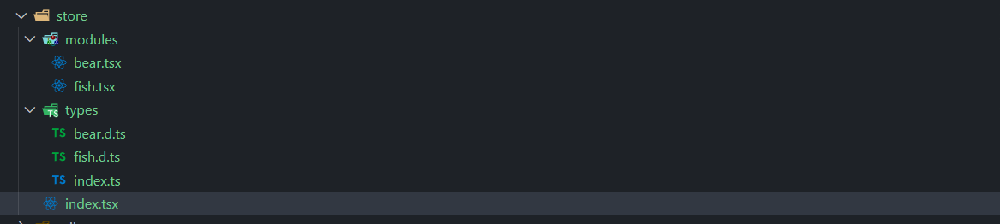

## 目录结构



- 1. /index.tsx

```tsx
import { create } from "zustand";
import { pick } from "lodash-es";
import { useRef } from "react";

import { createJSONStorage, persist, devtools } from "zustand/middleware";
import { immer } from "zustand/middleware/immer";
import { shallow } from "zustand/shallow";
import { IModules, State } from "@/store/types";

function getSliceModules(rest: any[]) {
  const modules = import.meta.glob(["./modules/*.tsx"], { eager: true }) as unknown as IModules;
  return Object.values(modules).reduce(
    (total, currentModule) => ({
      ...total,
      ...currentModule.default(...rest),
    }),
    {},
  );
}

export const useStore = create<State>()(
  devtools(
    persist(
      immer((...rest) => getSliceModules(rest)),
      {
        name: "react-tpl-store",
        storage: createJSONStorage(() => sessionStorage),
      },
    ),
  ),
);

export function useSelector<S extends object, T extends keyof S>(keys: T[]) {
  const previousState = useRef<Pick<S, T>>({} as Pick<S, T>);

  return (state: S) => {
    const nextState = pick(state, keys);
    return shallow(nextState, previousState.current)
      ? previousState.current
      : (previousState.current = nextState);
  };
}

export default (keys: (keyof State)[]) => {
  return useStore(useSelector(keys));
};
```

- 2. /modules/bear.tsx

```tsx
import { StateCreator } from "zustand";
import { State, BearSlice } from "@/store/types";

function getData(): Promise<number> {
  return new Promise((resolve) => {
    setTimeout(() => {
      resolve(2);
    }, 3000);
  });
}
const createBearSlice: StateCreator<State, [["zustand/immer", never]], [], BearSlice> = (set) => ({
  bears: 11,
  bearsInfo: {
    name: "三文鱼",
    age: 12,
  },
  addBear: async () => {
    set((state: State) => {
      state.bears++;
    });
  },
  asyncAddBear: async () => {
    console.log("三秒之后change bear 数量 ==> :");
    const res = await getData();
    set((state: State) => ({ bears: state.bears + res }));
  },
  changeBearName: (name: string) =>
    set((state: State) => {
      state.bearsInfo.name = name;
    }),
  eatFish: () => set((state: State) => ({ fishes: state.fishes - 1 })),
});

export default createBearSlice;
```

- 3. /modules/fish.tsx

```tsx
import { StateCreator } from "zustand";
import { State, FishSlice } from "@/store/types";

const createFishSlice: StateCreator<State, [["zustand/immer", never]], [], FishSlice> = (set) => ({
  fishes: 12,
  addFish: () => set((state: State) => ({ fishes: state.fishes + 1 })),
});

export default createFishSlice;
```

- 4. /types/index.ts

```ts
import { BearSlice } from "./bear";
import { FishSlice } from "./fish";

interface IModule {
  default: Function;
}

export interface IModules {
  string: IModule;
}
export type State = BearSlice & FishSlice;
export type { FishSlice, BearSlice };
```

- 5. /types/bear.d.ts

```ts
export type BearSlice = {
  bears: number;
  bearsInfo: {
    name: string;
    age: number;
  };
  addBear: () => void;
  eatFish: () => void;
  asyncAddBear: () => Promise<void>;
  changeBearName: (data: string) => void;
};
```

- 6. /types/fish.d.ts

```ts
export type FishSlice = {
  fishes: number;
  addFish: () => void;
};
```

## 使用

- App.tsx

```tsx
import useStore from "@/store";
function App() {
  const { fishes, addFish, bears, addBear, changeBearName, bearsInfo, asyncAddBear } = useStore([
    "fishes",
    "addFish",
    "bears",
    "addBear",
    "changeBearName",
    "bearsInfo",
    "asyncAddBear",
  ]);

  const changeBearNames = () => {
    changeBearName("zhangsan");
  };
  return (
    <div>
      <p>fishes----{fishes}</p>
      <button onClick={addFish}>addBear</button>

      <p>bears----{bears}</p>
      <p>bearsName----{bearsInfo.name}</p>
      <button onClick={addBear}>addBear</button>
      <button onClick={asyncAddBear}>async addBear</button>
      <button onClick={changeBearNames}>changeBearName</button>
    </div>
  );
}

export default App;
```

## 性能优化相关

- 1. 以下的使用方式会导致`与该数据无关且使用 store 的组件 rerender`
- 1-1.

```tsx
const { fishes, addFish } = useStore();
```

- 1-2.

```tsx
const { fishes, addFish } = useStore((state) => ({ addFish: state.addFish, fishes: state.fishes }));
```

- 2. 官方推荐解决上述问题的方式，代码如下所示
- 2-1. 官方推荐 1

```tsx
const fishes = useStore((state) => state.fishes);
const addFish = useStore((state) => state.addFish);
```

- 2-2. 官方推荐 2

```tsx
import { useShallow } from "zustand/react/shallow";
const { fishes, addFish } = useStore(
  useShallow((state) => ({ addFish: state.addFish, fishes: state.fishes })),
);
```

- 2-3. 我推荐的，其实就是基于官方的包装了一下

```tsx
export function useSelector<S extends object, T extends keyof S>(keys: T[]) {
  const previousState = useRef<Pick<S, T>>({} as Pick<S, T>);

  return (state: S) => {
    const nextState = pick(state, keys);
    return shallow(nextState, previousState.current)
      ? previousState.current
      : (previousState.current = nextState);
  };
}

export default (keys: (keyof State)[]) => {
  return useStore(useSelector(keys));
};
```

```tsx
import useStore from "@/store";

function App() {
  const { fishes, addFish } = useStore(["fishes", "addFish"]);
  return <div>app</div>;
}
```
